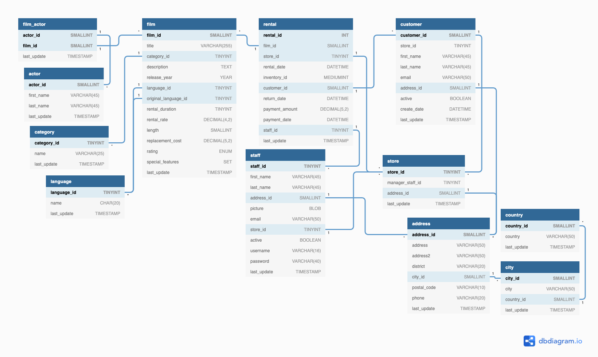

# Lab | Database normalization

I used [dbdiagram.io](https://dbdiagram.io/home) as a tool to create the diagram of 'Sakila' to show the relations between each tables. 

## The diagram of 'Sakila' database

## The process of creating diagram

First, I structured the database into two main parts as following

    1. FILM --'film' table and its related tables (left side of the diagram)
    2. RENTAL --'rental' table and its related tables (right side of the diagram)

Then I connected the tables by placing the tables containing foreign keys around the main ones. (ex. film -> film_actor -> actor)

### Table and column names

To avoid copy & pasting the table and column names, I imported the data from 'sakila-schema.sql'. However, it took some time to clean the data (for example deleting default condition). I could not find any better way to automate the process. 

### Primary keys and foreign keys

To make relation between primary keys and foreign keys, I used the code below. 

*Ref { actor.actor_id > film_actor.actor_id}*

Finally it was not easy to show 

